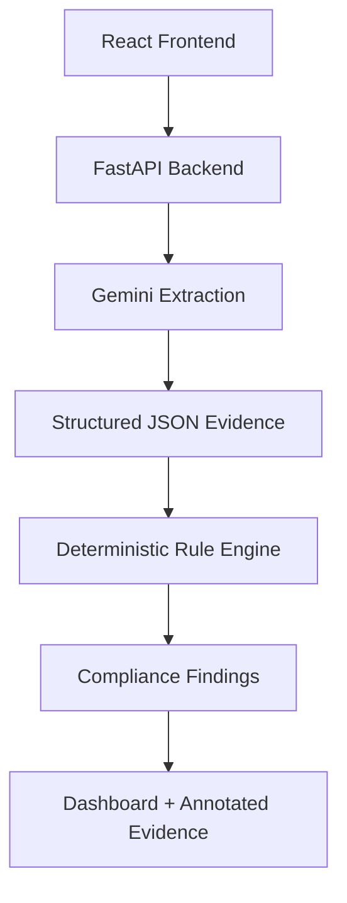

# LabelLens

**AI-assisted Legal Metrology (Packaged Commodities) Rules, 2011 review for product package labels.**

LabelLens takes a photo of a package's front / Principal Display Panel (PDP), uses Gemini Vision to transcribe the visible declarations (manufacturer, net quantity, MRP, dates, etc.) with bounding-box evidence, then runs that structured extraction through a **deterministic, rule-based engine** that checks it against India's Legal Metrology (Packaged Commodities) Rules, 2011. The result is an audit report — not a legal opinion — flagging what's compliant, what's a likely violation, and what a human reviewer still needs to check.

>  **Disclaimer:** LabelLens is a review aid, not a substitute for legal advice. It never claims to measure physical font size/contrast from a photo with certainty, and it is deliberately conservative — uncertain or unreadable declarations are flagged `NEEDS_REVIEW` rather than guessed at.

---

## System Architecture




The extraction step and the compliance step are intentionally separated: **Gemini only reads what's on the label** (and says "null"/uncertain when it can't tell), and **the rule engine — plain Python, no LLM — decides pass/fail** against the statute. This keeps compliance decisions auditable and reproducible.

---

## Features

-  **Single-image upload** → full compliance report via a FastAPI backend and a React dashboard.
-  **Evidence-backed extraction** — every extracted field can be traced to a transcribed text snippet and a normalized bounding box on the image.
-  **Annotated image output** — bounding boxes are drawn back onto the label for visual sign-off.
-  **Rule engine covering:**
  - Mandatory declarations (Rule 6): manufacturer/packer, importer & country of origin, generic name, net quantity, manufacture date, best-before date, MRP (inclusive of taxes), consumer care details, declaration language, unit sale price.
  - Declaration-format violations: prohibited count units (dozen/gross/score), sub-threshold unit escalation, misleading quantity qualifiers ("approx.", "when packed"), MRP sticker overlays (Rule 18(2)), Schedule II standard pack sizes (tea, coffee, biscuits, salt, atta, rice, edible oil, etc.).
  - Typography & placement heuristics (Rules 7–9): PDP boundary, quantity numeral height/aspect ratio, legibility/contrast, clear space around the quantity declaration.
  - Statutory exemptions (Rule 3): large packages (>25 kg/L), industrial/institutional (B2B) packaging, restaurant/hotel fast food, DPCO drug formulations.
-  **Outcome model:** every check resolves to `PASS`, `POSSIBLE_VIOLATION`, `NEEDS_REVIEW`, `EXEMPT`, or `SKIPPED`, and the overall report outcome rolls up to the worst status present.
-  **Unit-tested rule engine** (`test_rule_engine.py`) covering pass/fail/review/exempt paths.

---

## Tech stack

| Layer      | Technology |
|------------|------------|
| Extraction | Google Gemini (`google-genai`), configurable via `GEMINI_MODEL` |
| Backend    | FastAPI, Uvicorn, Pillow (for annotation) |
| Rules      | Pure Python, no external dependencies |
| Frontend   | React + Vite |
| Testing    | `unittest` |

---

## Project structure

```
.
├── app.py                 # CLI entry point (single image → JSON report on disk)
├── api.py                 # FastAPI server (upload endpoint + annotated image serving)
├── gemini_extractor.py    # Gemini Vision boundary — image in, structured facts out
├── rule_engine.py         # Deterministic Legal Metrology rules engine
├── image_annotator.py     # Draws evidence bounding boxes onto the source image
├── test_rule_engine.py    # Unit tests for the rule engine
├── index.html             # Vite entry HTML
├── vite.config.js         # Vite dev server + /api proxy config
├── package.json           # Frontend dependencies (React + Vite)
├── package-lock.json
└── requirements.txt        # Python dependencies
```

---

## Getting started

### Prerequisites

- Python 3.10+
- Node.js 18+
- A Google Gemini API key ([ai.google.dev](https://ai.google.dev))

### 1. Backend setup

```bash
# Create and activate a virtual environment
python -m venv .venv
source .venv/bin/activate      # Windows: .venv\Scripts\activate

# Install Python dependencies
pip install -r requirements.txt

# Set your Gemini API key (never hard-code this in source)
export GEMINI_API_KEY="your-api-key-here"   # Windows: set GEMINI_API_KEY=your-api-key-here

# Start the API server
python api.py
```

The API will be available at `http://127.0.0.1:8000`, with interactive docs at `http://127.0.0.1:8000/docs`.

### 2. Frontend setup

```bash
npm install
npm run dev
```

The dashboard runs on Vite's default dev server (e.g. `http://localhost:5173`) and proxies `/api` requests to the backend (see `vite.config.js`).

### 3. CLI usage (no frontend needed)

```bash
GEMINI_API_KEY=your-api-key-here python app.py path/to/package.jpg --output reports/report.json
```

This prints a summary (`outcome`, `counts`, report path) and writes the full report to `reports/report.json`.

---

## API reference

### `GET /api/health`
Health check. Returns `{"status": "ok"}`.

### `POST /api/reviews`
Upload a label image for review.

- **Body:** `multipart/form-data` with an `image` field (JPEG, PNG, or WebP, ≤ 10 MB).
- **Response:** JSON audit report, including:
  - `outcome` — overall result: `PASS`, `POSSIBLE_VIOLATION`, `NEEDS_REVIEW`, or `EXEMPT`
  - `counts` — tally of findings by status
  - `findings` — list of individual rule results (`rule_id`, `outcome`, `message`, `observed`)
  - `extraction` — the raw Gemini extraction (facts + evidence)
  - `annotated_image_url` — path to the image with evidence boxes drawn on it

### `GET /api/images/{filename}`
Serves an annotated image previously generated by `/api/reviews`.

---

## Rule engine outcomes

| Status | Meaning |
|---|---|
| `PASS` | The declaration was found and satisfies the rule. |
| `POSSIBLE_VIOLATION` | Positive evidence of a statutory violation (e.g. MRP sticker overlay, non-standard pack size, prohibited count unit). |
| `NEEDS_REVIEW` | The engine couldn't confirm compliance from the available evidence (e.g. field unreadable, borderline font-height ratio) — a human should check. |
| `EXEMPT` | The package qualifies for a statutory exemption (Rule 3), so downstream mandatory-declaration checks are skipped. |
| `SKIPPED` | Rule requires information the engine can't evaluate from an image alone (e.g. distributor consignment invoices for bulk exemptions). |

The overall report `outcome` is the worst status present, in the order: `POSSIBLE_VIOLATION` > `NEEDS_REVIEW` > `EXEMPT` > `PASS`.

---

## Running tests

```bash
python -m unittest test_rule_engine.py -v
```

---

## Environment variables

| Variable | Required | Description |
|---|---|---|
| `GEMINI_API_KEY` | Yes | API key for Gemini Vision extraction. Never commit this to source control. |
| `GEMINI_MODEL` | No | Overrides the default Gemini model (defaults to `gemini-3.6-flash`). |
| `CORS_ORIGINS` | No | Comma-separated list of allowed origins for the API (defaults to common local Vite ports). |

---

## Notes & limitations

- Gemini is used strictly as a **transcription layer** — it is prompted not to make legal conclusions or invent missing declarations, and to return `null` when a field is unreadable or uncertain.
- Typography checks (numeral height, aspect ratio, contrast) are **heuristics** based on bounding-box geometry from the extraction step, not physical measurements, and are intentionally routed to `NEEDS_REVIEW` when borderline.
- This tool does not store your Gemini API key; supply it via environment variable at runtime.

---
